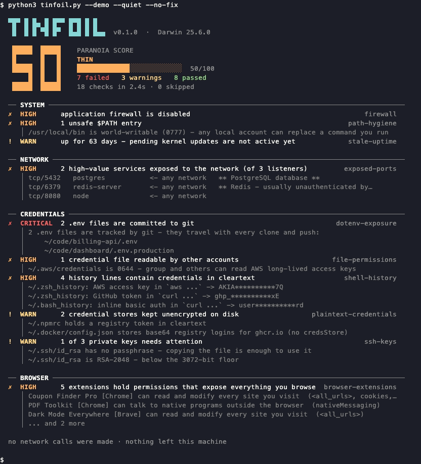
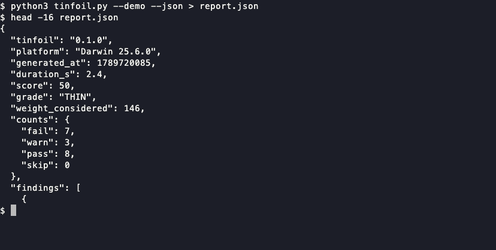

<div align="center">

```
▀█▀ █ █▄ █ █▀▀ █▀█ █ █
 █  █ █ ▀█ █▀  █▄█ █ █▄▄
```

**Your machine's attack surface, in one command.**

Every laptop quietly accumulates exposure: a database bound to `0.0.0.0`, an AWS key
pasted into shell history, a `.env` that got committed, a browser extension that can
read every page you open. `tinfoil` finds all of it in about three seconds and gives
you a number.

[](LICENSE)
[](https://www.python.org/)
[](#)
[](#why-one-file)
[](#privacy)

</div>

---



<details>
<summary><b>Prefer text?</b> The same run in full, including the passing checks and the remediation block the recording trims.</summary>

```
  ▀█▀ █ █▄ █ █▀▀ █▀█ █ █  
   █  █ █ ▀█ █▀  █▄█ █ █▄▄  v0.1.0  ·  Darwin 25.6.0

   █████  █████    PARANOIA SCORE
   █      █   █    THIN
   █████  █   █    █████████████░░░░░░░░░░░░░  50/100
       █  █   █    7 failed   3 warnings   8 passed
   █████  █████    18 checks in 2.4s · 0 skipped

  ── SYSTEM ────────────────────────────────────────────────────────────────────────────────
  ✗  HIGH      application firewall is disabled                                   firewall
  ✗  HIGH      1 unsafe $PATH entry                                           path-hygiene
     │ /usr/local/bin is world-writable (0777) - any local account can replace a command…
  !  WARN      up for 63 days - pending kernel updates are not active yet     stale-uptime
  ✓  OK        FileVault is on                                             disk-encryption
  ✓  OK        Gatekeeper is enforcing                                          gatekeeper
  ✓  OK        SIP is enabled                                                          sip
  ✓  OK        password required on wake                                       screen-lock

  ── NETWORK ───────────────────────────────────────────────────────────────────────────────
  ✗  HIGH      2 high-value services exposed to the network (of 3 listeners) exposed-ports
     │ tcp/5432   postgres           <- any network   ** PostgreSQL database **
     │ tcp/6379   redis-server       <- any network   ** Redis - usually unauthenticated…
     │ tcp/8080   node               <- any network
  ✓  OK        Docker is local-socket only                                 docker-exposure
  ✓  OK        no SSH server is listening                                       ssh-server

  ── CREDENTIALS ───────────────────────────────────────────────────────────────────────────
  ✗  CRITICAL  2 .env files are committed to git                           dotenv-exposure
     │ 2 .env files are tracked by git - they travel with every clone and push:
     │     ~/code/billing-api/.env
     │     ~/code/dashboard/.env.production
  ✗  HIGH      1 credential file readable by other accounts               file-permissions
     │ ~/.aws/credentials is 0644 - group and others can read AWS long-lived access keys
  ✗  HIGH      4 history lines contain credentials in cleartext              shell-history
     │ ~/.zsh_history: AWS access key in `aws ...` -> AKIA**********7Q
     │ ~/.zsh_history: GitHub token in `curl ...` -> ghp_**********xE
     │ ~/.bash_history: inline basic auth in `curl ...` -> user**********rd
  !  WARN      2 credential stores kept unencrypted on disk          plaintext-credentials
     │ ~/.npmrc holds a registry token in cleartext
     │ ~/.docker/config.json stores base64 registry logins for ghcr.io (no credsStore)
  !  WARN      1 of 3 private keys needs attention                                ssh-keys
     │ ~/.ssh/id_rsa has no passphrase - copying the file is enough to use it
     │ ~/.ssh/id_rsa is RSA-2048 - below the 3072-bit floor
  ✓  OK        git credentials go through osxkeychain                           git-config
  ✓  OK        no credentials exported into the environment                    env-secrets

  ── BROWSER ───────────────────────────────────────────────────────────────────────────────
  ✗  HIGH      5 extensions hold permissions that expose everything you browse browser-extensions
     │ Coupon Finder Pro [Chrome] can read and modify every site you visit  (<all_urls>,…
     │ PDF Toolkit [Chrome] can talk to native programs outside the browser …
     │ Dark Mode Everywhere [Brave] can read and modify every site you visit  (<all_urls>)
     │ ... and 2 more

  ── FIX FIRST ─────────────────────────────────────────────────────────────────────────────
  • Exposed .env files
      git rm --cached .env && echo '.env' >> .gitignore
      # already pushed? rotate those credentials, history rewriting is not enough
  • Services reachable from the network
      # bind development servers to 127.0.0.1, not 0.0.0.0
  • Secrets in shell history
      # scrub the offending lines, then rotate every credential listed above
  • Host firewall
      sudo /usr/libexec/ApplicationFirewall/socketfilterfw --setglobalstate on
  • Credential file permissions
      chmod 600 ~/.aws/credentials
  • Over-privileged browser extensions
      # audit them: chrome://extensions  (Details > Site access > On click)

  no network calls were made · nothing left this machine
```

</details>

<sub>Synthetic findings (<code>tinfoil --demo</code>), so you can see the shape of a report before pointing it at your own machine.</sub>

---

## Run it

One file, standard library only. Nothing to install.

```bash
git clone https://github.com/gorkemguler/tinfoil.git
cd tinfoil
python3 tinfoil.py
```

Or grab the single file:

```bash
curl -fsSLO https://raw.githubusercontent.com/gorkemguler/tinfoil/main/tinfoil.py
python3 tinfoil.py
```

> Yes, a `curl … | python3 -` one-liner would fit here. A tool that audits your machine
> is the last place that belongs. It is one readable file — open it first, then run it.

Want to see the output before pointing it at your own machine? `python3 tinfoil.py --demo`.

## What it finds

| Check | Catches | Weight |
|---|---|---|
| `disk-encryption` | FileVault / LUKS off — the disk is readable by anyone holding it | 12 |
| `exposed-ports` | Postgres, Redis, Mongo, Docker, VNC listening on `0.0.0.0` | 12 |
| `dotenv-exposure` | `.env` files tracked by git, or readable by other accounts | 10 |
| `ssh-keys` | Private keys with no passphrase, mode `0644`, RSA-2048, DSA | 10 |
| `shell-history` | AWS keys, GitHub tokens, `curl -u user:pass` sitting in `.zsh_history` | 9 |
| `plaintext-credentials` | Tokens in `.npmrc`, `.netrc`, `.git-credentials`, `.docker/config.json` | 9 |
| `ssh-server` | `sshd` reachable from the network with password auth or root login | 9 |
| `firewall` | Host firewall disabled, stealth mode off | 8 |
| `docker-exposure` | Docker API on TCP — unauthenticated root on the host | 8 |
| `browser-extensions` | Extensions that can read every page, your cookies, or your clipboard | 8 |
| `file-permissions` | `~/.aws/credentials`, `~/.ssh`, `~/.gnupg` readable by other accounts | 8 |
| `sip` · `gatekeeper` · `quarantine` | macOS integrity protections switched off | 7/7/5 |
| `path-hygiene` | World-writable `$PATH` entries — trivial command hijacking | 7 |
| `sudo-nopasswd` | `NOPASSWD` sudo rules | 7 |
| `pending-updates` | Security updates sitting uninstalled | 7 |
| `git-config` | `credential.helper=store`, `http.sslVerify=false` | 6 |
| `env-secrets` | Credentials exported into every process you launch | 6 |
| `screen-lock` · `auto-login` | Waking or booting the machine needs no password | 6/6 |
| `stale-uptime` | Kernel patches installed but never activated | 3 |

`python3 tinfoil.py --list` prints the live list with severities and platforms.

Each check contributes its weight to the score: pass earns it all, a warning earns half,
a failure earns none, and anything that cannot be determined is left out of the maths
entirely rather than silently counted as a pass.

## Privacy

This is a tool that reads your SSH keys and your shell history. The guarantees are
narrow and deliberate:

- **No network calls.** Not telemetry, not an update check, not a "reputation lookup".
  `tinfoil.py` imports no networking module, and a test in CI fails the build if one ever
  appears.
- **Nothing is written.** The report goes to stdout. No cache, no report file, no state.
- **Secrets are redacted before display.** A discovered token renders as
  `AKIA**********7Q`. Tests assert that the original value never reaches the output.
- **Nothing runs as root.** Checks that would need privileges are reported as skipped
  rather than escalating.
- **No auto-fixing.** It prints the command; you decide whether to run it. A security
  tool that mutates your system unprompted is a bigger risk than the findings.

## In CI

```bash
python3 tinfoil.py --json --fail-under 80
```

Exit code `1` when the score drops below the threshold, `0` otherwise — enough to gate a
build or fail a runner image that drifted.



```yaml
- name: Audit the runner
  run: python3 tinfoil.py --json --fail-under 85 | tee tinfoil.json
```

## Options

```
--demo               sample report with synthetic data
--json               machine-readable output
--deep               wider filesystem scan (depth 7 instead of 4)
--only IDS           run just these checks, comma-separated
--skip IDS           skip these checks
--list               print every check and exit
--quiet              hide passing checks
--all                also show skipped checks and why they were skipped
--no-fix             omit the remediation section
--color auto|always|never
--fail-under N       exit 1 when the score is below N
```

`NO_COLOR` is honoured.

## Adding a check

Drop a `.py` file in `~/.tinfoil/checks/` and it is picked up on the next run. No
imports, no boilerplate — the helpers are injected:

```python
@check("airdrop", "AirDrop discoverability", "network", severity=MEDIUM, weight=4,
       platforms=("Darwin",))
def chk_airdrop():
    rc, out, _ = run(["defaults", "read", "com.apple.sharingd", "DiscoverableMode"])
    if "Everyone" in out:
        return Result(FAIL, "AirDrop is discoverable by everyone nearby",
                      fix=["# Control Center > AirDrop > Contacts Only"])
    return Result(PASS, "AirDrop is not open to everyone")
```

Available in that namespace: `check`, `Result`, `run`, `read_text`, `tail_text`,
`mode_of`, `tilde`, `redact`, `scan_secrets`, `HOME`, `IS_MAC`, `IS_LINUX`, and the
`CRITICAL`/`HIGH`/`MEDIUM`/`LOW` and `FAIL`/`WARN`/`PASS`/`SKIP` constants.

If the check is generally useful, send it as a PR — that is the fastest way to
contribute here. See [CONTRIBUTING.md](CONTRIBUTING.md).

## Why one file

Because a security tool asking you to `pip install` a dependency tree has already lost
the argument. One file you can read end to end in fifteen minutes, no supply chain, no
virtualenv, works on the Python that shipped with your OS.

## How it compares

|  | `tinfoil` | Lynis | osquery | trufflehog / gitleaks |
|---|---|---|---|---|
| Audience | your own laptop | servers, compliance | fleets, at scale | repositories |
| Setup | one file | package install | agent + scheduler | binary install |
| Runs as root | no | usually | yes | no |
| Output | one score, ranked fixes | hundreds of lines | SQL you write | secret list |
| Browser extensions | yes | no | partial | no |
| Shell history secrets | yes | no | no | no |

They are not competitors so much as different altitudes. Lynis hardens a server;
`tinfoil` answers "is my laptop leaking?" in the time it takes to read the answer.

## FAQ

**Does it need sudo?** No, and it will not ask. Checks that genuinely require privileges
report as skipped with the reason, which `--all` shows you.

**Why did my score drop after an update?** New checks raise the denominator. The score is
a relative signal to act on, not a metric to optimise.

**It flagged something that is fine on my setup.** Likely true — `--skip` it, and please
open an issue so the heuristic gets tightened. False positives in a security tool are a
bug, not a conservative default.

**Windows?** Not yet. The check bodies are POSIX-shaped; a WSL run works today, native
Windows needs a contributor.

## Development

```bash
make test     # unit tests, no test dependencies either
make audit    # audit this machine, including the checks that were skipped
make gif      # re-record the README recordings (needs vhs)
```

The recordings are generated from [`assets/demo.tape`](assets/demo.tape) and
[`assets/ci.tape`](assets/ci.tape) with [vhs](https://github.com/charmbracelet/vhs), so a
change to the report format is a one-command re-record rather than a manual screen
capture. The tapes are sized to fit the report exactly — if you change what the report
prints, read the comment at the top of the tape before re-recording.

## License

MIT — see [LICENSE](LICENSE).
